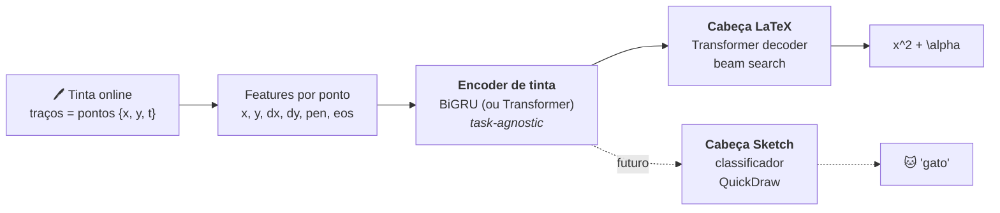

<div align="center">

# 🪨 Rosetta — Handwritten Math → LaTeX

**Escreva matemática à mão. Receba LaTeX. Veja o resultado.**

*Reconhecimento de expressões matemáticas manuscritas a partir da trajetória da caneta
(tinta online), no espírito do Math Notes do iPad — com seq2seq treinado localmente.*


</div>

---

## 🎯 O que ele faz

Você desenha num canvas; o sistema consome a **sequência de pontos da caneta** (não uma
imagem!) e devolve **LaTeX normalizado** — e, quando faz sentido, o resultado calculado
via SymPy.

**Exemplo real do pipeline** (tinta do CROHME → HTTP → modelo → LaTeX, verificado ponta a ponta):

```
tinta (23 traços, ~800 pontos)  ──►  POST /recognize  ──►

S = \Bigg ( \sum _ { i = 1 } ^ { n } \theta _ i - ( n - 2 ) \pi \Bigg ) r ^ 2
```

E o `/evaluate` resolve o que dá para resolver:

| Você escreve | SymPy responde |
|---|---|
| `\frac{3}{4} + \frac{1}{4}` | `1` |
| `\sqrt{16} + 2^3` | `12` |
| `2x + 4 = 10` | `x = 3` |

## 🧠 Arquitetura: um encoder, várias cabeças

A decisão central do projeto: **a entrada e o encoder são agnósticos à tarefa**. O mesmo
encoder de tinta que lê matemática vai, na Fase 4, classificar desenhos estilo
[QuickDraw](https://quickdraw.withgoogle.com/) — só trocando a cabeça de saída.



O contrato da tinta é **um só** (`schemas/ink.schema.json`), espelhado em TypeScript
(web), Pydantic (api) e dataclasses (ml) — treino e inferência usam exatamente a mesma
representação.

## 📊 Status & resultados

| Fase | Entrega | Status |
|---|---|---|
| **0** | Scaffold, InkML→tensores, tokenizer LaTeX, esquema de tinta | ✅ |
| **1** | Prova do seq2seq: overfit em 32 amostras reais do CROHME | ✅ `exact_match = 1.0`, `cer = 0.0` |
| **2** | Augmentation, beam search, treino no CROHME completo (8.9k) | 🔄 em treino (RTX 5050, AMP) |
| **3** | API `/recognize` + canvas + KaTeX + SymPy `/evaluate` | ✅ verificado ponta a ponta |
| **4** | Cabeça de classificação de desenhos (QuickDraw) | 🔜 |

Detalhes em [`docs/roadmap.md`](docs/roadmap.md) · decisões em [`docs/adr/`](docs/adr).

## 🚀 Experimente em 2 minutos (sem baixar dataset)

O repositório inclui um gerador de tinta sintética — dá para provar o pipeline inteiro
(dados → treino → inferência) sem nenhum download:

```bash
# deps (uv) — ou use um venv com torch, numpy, pyyaml
uv sync

# 1. gera 32 expressões como InkML sintético
python -m hmer_ml.data.synth --out data/synth --n 32

# 2. treina até memorizar (~2 min em GPU; funciona em CPU)
python -m hmer_ml.train --config ml/configs/overfit_synth.yaml

# 3. avalia: exact_match = 1.0 esperado
python -m hmer_ml.evaluate --config ml/configs/overfit_synth.yaml \
    --ckpt checkpoints/overfit_synth/last.ckpt
```

> 💡 Sem `uv sync`, rode com `PYTHONPATH=ml/src`. GPUs RTX 50xx (Blackwell) exigem a
> build **cu128** do PyTorch: `pip install torch --index-url https://download.pytorch.org/whl/cu128`.

## 🖥️ Rodando o app completo

```bash
# Terminal 1 — API (da raiz do repo)
export HMER_CKPT=checkpoints/crohme/last.ckpt
export HMER_CONFIG=ml/configs/crohme.yaml
uvicorn hmer_api.main:app --port 8000

# Terminal 2 — Web
cd web && npm install && npm run dev
# → http://localhost:3000  (desenhe!)
```

Sem `HMER_CKPT` a API sobe em modo stub (HTTP 501) — útil para desenvolver o frontend
contra o contrato antes de ter modelo treinado.

## 🏋️ Treinando com dados reais

```bash
# CROHME (~9k expressões; ver docs/datasets.md para download)
python -m hmer_ml.train --config ml/configs/crohme.yaml       # AMP + bucketing + augment
python -m hmer_ml.evaluate --config ml/configs/crohme.yaml \
    --ckpt checkpoints/crohme/last.ckpt --root data/crohme/valid --beam 4
```

Feito para **uma GPU de notebook (6–8 GB)**: mixed precision, acumulação de gradiente,
bucketing por comprimento e checkpoint com **resume automático** — pode interromper com
`Ctrl+C` e retomar com o mesmo comando.

| Dataset | Amostras | Papel |
|---|---|---|
| [MathWriting](https://github.com/google-research/google-research/tree/master/mathwriting) (Google, 2024) | ~230k humanas + 400k sintéticas | principal (Fase 2+) |
| [CROHME](https://www.kaggle.com/datasets/ntcuong2103/crohme2019) (2011–2019) | ~8.9k treino + testes 2014/16/19 | validação rápida / benchmark |

## 📁 Estrutura do monorepo

```
├── ml/          # PyTorch: dados (InkML), tokenizer, encoder/heads, treino, beam search
│   ├── configs/ #   YAML com herança (_base_) — escalar modelo sem tocar em código
│   └── tests/   #   19 testes (pipeline de dados, modelo, augmentation)
├── api/         # FastAPI: POST /recognize (tinta→LaTeX), POST /evaluate (SymPy)
│   └── tests/   #   8 testes (contrato, SymPy, integração com modelo real)
├── web/         # Next.js: canvas com PointerEvents → proxy → render KaTeX
├── schemas/     # ink.schema.json — contrato único da tinta (web = api = ml)
└── docs/        # visão, datasets, roadmap e ADRs (decisões de arquitetura)
```

## 🔩 Decisões de arquitetura (ADRs)

| # | Decisão | Por quê |
|---|---|---|
| [0001](docs/adr/0001-online-ink-input.md) | Tinta online, não imagem | trajetória > pixels p/ escrita; datasets InkML nativos |
| [0002](docs/adr/0002-encoder-recurrent-vs-transformer.md) | BiGRU default, Transformer opcional | cabe em 6–8 GB de VRAM; troca por config |
| [0003](docs/adr/0003-custom-latex-tokenizer.md) | Tokenizer LaTeX custom | `\frac` = 1 token; vocab fechado do dataset |
| [0004](docs/adr/0004-shared-ink-schema.md) | Esquema de tinta único | treino e inferência com a mesma representação |
| [0005](docs/adr/0005-python-dependency-uv.md) | uv workspace | monorepo Python com lockfile reprodutível |
| [0006](docs/adr/0006-pluggable-heads.md) | Encoder + cabeças plugáveis | extensão p/ desenhos é requisito, não promessa |

## 🗺️ Próximos passos

- [ ] Concluir treino no CROHME completo e reportar CER/exact-match no test 2019
- [ ] Escalar para o MathWriting (config pronto)
- [ ] Fase 4: cabeça de classificação + QuickDraw, reusando o encoder
- [ ] Futuro: fusão multimodal (tinta + imagem renderizada) e refino por LLM
