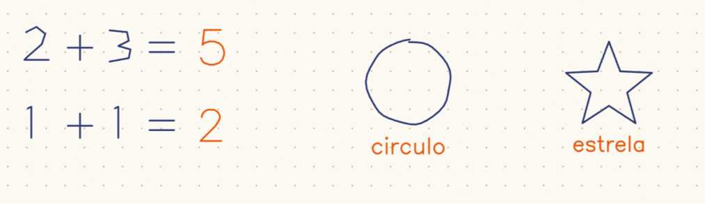
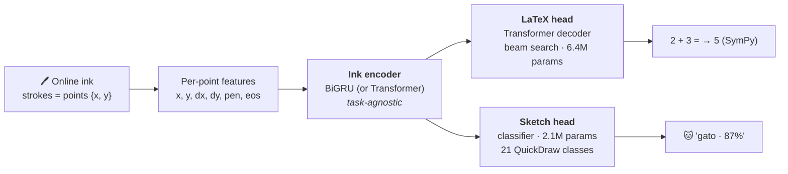

<div align="center">

# 🪨 Rosetta — the handwritten notebook that answers back

**Take notes by hand. End a calculation with `=` and the answer writes itself.
Draw something and the notebook names it.**

*Online handwriting recognition from raw pen trajectory (ink, not images), in the
spirit of the iPad's Math Notes — one task-agnostic ink encoder, multiple heads,
all trained locally on a laptop GPU.*




*Real output: the blue ink is handwritten; every orange mark was drawn by the models.*

</div>

---

## 📓 What it does

The web app is a **notebook**: a long ruled sheet (with pages) where you write
anything — class notes, text, math, doodles — with pen, eraser and undo. Two things
make it answer back:

**1. Math solves itself.** End a calculation with `=` and pause the pen for a second.
The page's strokes are segmented *amid the notes* (no lasso, no selection), the
calculation is recognized (seq2seq, ink → LaTeX), solved with SymPy, and the answer
**draws itself in orange ink** right after the `=`:

```
  you write:   2 + 3 =            the notebook writes:   2 + 3 = 𝟓  (orange, animated)
  you write:   2x + 4 = 10        the notebook writes:   x = 3
```

Re-running never duplicates — the orange ink itself marks a calculation as done.
There's an `auto` toggle and a manual `resolver =` button; a side panel keeps the
solved history rendered with KaTeX.

**2. Drawings get named.** Sketch something, press **`desenho?`**: the most recent
drawing (spatially clustered strokes) goes to a classifier trained on Google
QuickDraw — **21 categories, 92% validation accuracy** — and the label is written in
orange ink under the drawing ("gato", "casa", "bicicleta"…), confidence in the toolbar.

Everything persists locally: pages, ink and history survive reloads.

## 🧠 Architecture: one encoder, multiple heads

The core design decision (ADR 0006): **the input and the encoder are task-agnostic**.
The same BiGRU ink encoder powers both heads today — swapping tasks is a config line.



There is **one single ink contract** (`schemas/ink.schema.json`), mirrored in
TypeScript (web), Pydantic (api) and dataclasses (ml) — training and inference use
the exact same representation. Geometry is canonicalized server-side
(bbox normalization + fixed-step arc-length resampling), so pen density and scale
never matter.

## 📊 Status & results

| Phase | Deliverable | Status |
|---|---|---|
| **0** | Scaffold, InkML→tensors, LaTeX tokenizer, shared ink schema | ✅ |
| **1** | seq2seq proof: overfit on 32 real CROHME samples | ✅ `exact_match = 1.0` |
| **2** | Augmentation, beam search, full CROHME training (8.9k, 60 epochs) | ⚠️ trained, but **overfits**: 77% exact on train vs **5% on valid** — retrain with fixed resampling + MathWriting planned |
| **3** | `/recognize` + `/evaluate` (SymPy) + KaTeX rendering | ✅ verified end-to-end |
| **3.5** | **The notebook**: free-form pages, math detected amid notes, answer drawn as ink | ✅ verified live in the browser |
| **4** | Sketch head on the same encoder (QuickDraw, 21 classes) | ✅ **92% val accuracy**, live in the notebook |

The honest caveat: the math recognizer currently only generalizes to simple
expressions — the CROHME-only training memorized its 8.9k samples (diagnosed via a
density-sensitivity experiment: interpolating the same ink ×3 dropped exact-match from
12/15 to 0/15). The sketch head, trained from day one with fixed-step resampling,
shows the fix works: clean 66%→92% progression with no train/val gap.
Details in [`docs/roadmap.md`](docs/roadmap.md) · decisions in [`docs/adr/`](docs/adr).

## 🚀 Run the notebook

```powershell
# terminal 1 — model API (loads both checkpoints at startup)
.\scripts\serve_api.ps1                      # defaults: contas + desenhos, CPU, :8000

# terminal 2 — the notebook
cd web; npm install; npm run dev             # → http://localhost:3000
```

Write `2 + 3 =` and pause; draw a cat and press `desenho?`. Without checkpoints the
API starts in stub mode (HTTP 501) — handy for frontend work against the contract.

If a port gets stuck (orphaned server on Windows):
`Get-NetTCPConnection -LocalPort 8000 -State Listen | % OwningProcess | % { Stop-Process -Id $_ -Force }`

## 🧪 Prove the pipeline in 2 minutes (no dataset download)

The repo ships a synthetic ink generator — enough to prove data → training →
inference with zero downloads:

```bash
uv sync                                                   # or venv + PYTHONPATH=ml/src

python -m hmer_ml.data.synth --out data/synth --n 32      # 1. synthetic InkML
python -m hmer_ml.train --config ml/configs/overfit_synth.yaml   # 2. ~2 min on GPU
python -m hmer_ml.evaluate --config ml/configs/overfit_synth.yaml \
    --ckpt checkpoints/overfit_synth/last.ckpt            # 3. exact_match = 1.0
```

> 💡 RTX 50xx GPUs (Blackwell) require the **cu128** PyTorch build:
> `pip install torch --index-url https://download.pytorch.org/whl/cu128`.

## 🏋️ Training on real data

```bash
# math: CROHME (~9k expressions; see docs/datasets.md for download)
python -m hmer_ml.train --config ml/configs/crohme.yaml
python -m hmer_ml.evaluate --config ml/configs/crohme.yaml \
    --ckpt checkpoints/crohme/last.ckpt --root data/crohme/valid --beam 4

# sketches: QuickDraw (Phase 4 — same encoder, classification head)
python scripts/download_quickdraw.py            # 21 categories, ~170 MB (byte-range)
python -m hmer_ml.train_sketch --config ml/configs/quickdraw.yaml   # ~50 min on RTX 5050
```

Built for **a single laptop GPU (6–8 GB)**: mixed precision, gradient accumulation,
length bucketing, and checkpointing with **automatic resume** — interrupt with
`Ctrl+C` and pick up right where it left off with the same command.

| Dataset | Samples | Role |
|---|---|---|
| [CROHME](https://www.kaggle.com/datasets/ntcuong2103/crohme2019) (2011–2019) | ~8.9k train + test sets | math — current checkpoint (overfits; see status) |
| [MathWriting](https://github.com/google-research/google-research/tree/master/mathwriting) (Google, 2024) | ~230k human + 400k synthetic | math — the real fix for generalization (next) |
| [QuickDraw](https://github.com/googlecreativelab/quickdraw-dataset) (simplified) | 21 classes × ~5.8k used | sketches — trained, 92% val accuracy |

## 📁 Monorepo layout

```
├── ml/          # PyTorch: data (InkML/QuickDraw), tokenizer, encoder/heads, train loops,
│   ├── configs/ #   beam search, "=" segmentation. YAML configs with inheritance (_base_)
│   └── tests/   #   34 tests
├── api/         # FastAPI: /recognize (ink→LaTeX), /evaluate (SymPy), /page/process
│   └── tests/   #   (notebook: contas amid notes), /sketch/recognize. Hershey ink font.
│                #   22 tests
├── web/         # Next.js: the notebook — pages, pens/eraser/undo, auto-solve, KaTeX panel
├── xournalpp-plugin/  # paused: Lua plugin with the same backend (no stroke events in Lua API)
├── scripts/     # serve_api.ps1, dataset downloads, glyph generator, e2e checks
├── schemas/     # ink.schema.json — single ink contract (web = api = ml)
└── docs/        # vision, datasets, roadmap, and ADRs (architecture decisions)
```

> **Xournal++ (paused experiment):** before the notebook, the same backend powered a
> Lua plugin for Xournal++ (`scripts/install_plugin.ps1`, Ctrl+M). It works, but the
> Lua API has no stroke events — no write-time trigger — so the web notebook became
> the primary interface.

## 🔩 Architecture decisions (ADRs)

| # | Decision | Why |
|---|---|---|
| [0001](docs/adr/0001-online-ink-input.md) | Online ink, not images | trajectory beats pixels for handwriting; native InkML datasets |
| [0002](docs/adr/0002-encoder-recurrent-vs-transformer.md) | BiGRU by default, Transformer optional | fits in 6–8 GB VRAM; swappable via config |
| [0003](docs/adr/0003-custom-latex-tokenizer.md) | Custom LaTeX tokenizer | `\frac` is one token; closed vocab from the dataset |
| [0004](docs/adr/0004-shared-ink-schema.md) | Single shared ink schema | training and inference use the same representation |
| [0005](docs/adr/0005-python-dependency-uv.md) | uv workspace | Python monorepo with a reproducible lockfile |
| [0006](docs/adr/0006-pluggable-heads.md) | Encoder + pluggable heads | delivered: the sketch head reused the encoder unchanged |

## 🗺️ Roadmap

- [ ] **Fix math generalization**: retrain CROHME with `resample_step: 0.004`
      (train = inference, like the sketch head), then scale to MathWriting
- [ ] Phase 4 (next): more sketch categories; auto-triage math/text/sketch in the
      same pass (replace the `=` pair heuristic with a learned detector)
- [ ] Report CER/exact-match on the CROHME 2019 test set after the retrain
- [ ] Future: multimodal fusion (ink + rendered image) and LLM-based output refinement
